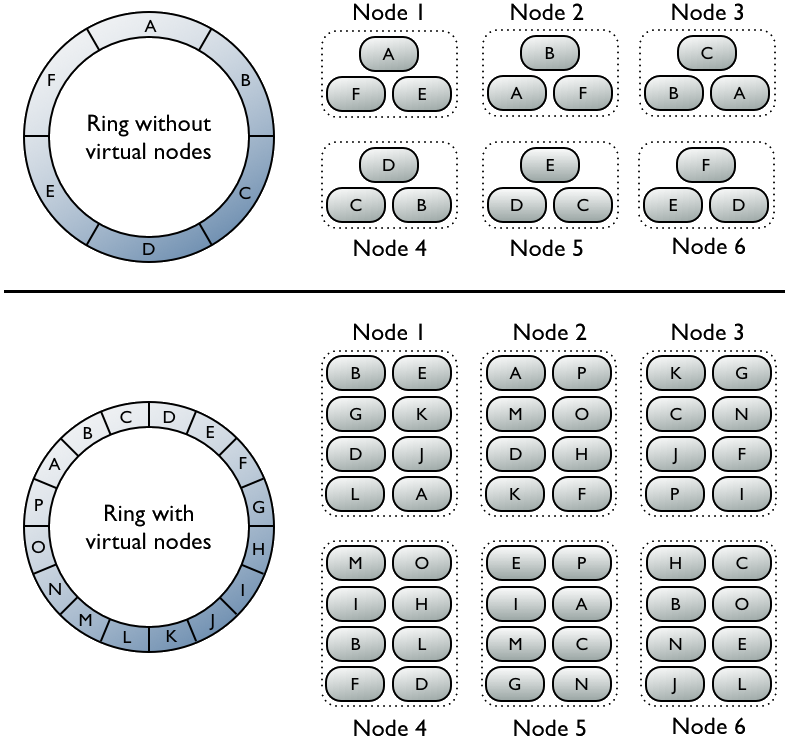

.. _cassandra:

Cassandra
=========

Intro
-----

Cassandra uses consistent hashing to distribute data and transfers request and data between nodes directly (peer to peer), much the same way as :ref:`dynamo`. A client may choose, upon each request (SELECT, UPDATE, INSERT, DELETE...), how much consistency they desire (ie: how many nodes to respond before a confirmed operation). Interaction with Cassandra uses *Cassandra Query Language* (CQL), which is nearly identical to SQL. Cassandra allows you to apply replication configurations to each of your databases (ie: keyspaces) which take into account running a keyspace across multiple datacenters and physical racks.

In contrast to Dynamo's preference list, any Cassandra node in a cluster can become coordinator for any read/write request. Similar to Dynamo's "hinted handoff," if one or more nodes responsible for a particular set of data are down, data is simply written to another node which temporarily holds the data until the downed node comes back online.

When data is written to Cassandra, it is first written to a commit log. It is also written to an in-memory structure called a memtable, which is eventually flushed to a disk structure called a *sorted strings table* (sstable). When a read request comes in, it is sent out to the node(s) containing the data, who then perform their work in parallel. If a node is down, the request is forwarded to one of its replicas.

Regarding performance, in 2011 Netflix was able to achieve 3.3million writes per second (1.1million with N=3) across three amazon availability zones using 288 medium size instances (96 instances per AZ). Cassandra is touted to have a linear performance increase as you add more nodes.

With regards to data structure, Cassandra can store structured, semi structured, and unstructured data. In contrast to RDBMS's, you can't do JOINs, so data tends to be pretty denormalized (ie: lots of columns). This is no big deal - Cassandra operates very quickly on objects with many thousands of columns. Within a keyspace are one or more column families, which are like relational tables. These families have one to many thousands of columns, with both primary and secondary indexes on columns being supported. More on this later.

Datastax is the main "enterprise support" for Cassandra company. They employ some Cassandra contributors and have employees who sit on Apache's board.

Data Model
----------
A table in Cassandra is a distributed multi dimensional map, indexed by a key. The value is an object which is highly structured. The row key in a table is a string with no size restrictions, although typically 16 to 36 bytes long. Every operation under a single row key is atomic per replica no matter how many columns are being read or written into.

Columns are grouped together into sets called column families very similar to what happens in BigTable. Cassandra exposes two kinds of column families, Simple and Super column families. Super column families can be visualized as a column family within a column family. Furthermore, applications can specify the sort order of columns within a super column or simple column, sorted either by time or by name. Time sorting is good for things like inbox search, where results are always in time sorted order.

Any column within a column family is accessed using the convention *column_family : column* and any column within a column family that is of type super is accessed using hte convention *column_family : super_column : column*. More on this later.

Typically, applications use a dedicated Cassandra cluster and manage them as part of their service. Although the system supports the notion of multiple tables, all deployments (at facebook) have only one table in their schema. In other deployments, users may have multiple tables which are each designed to be efficient in serving certain types of queries (eg: grouping by an attribute, ordering by an attribute, filtering based on some set of conditions...etc). Using separate tables and (most likely necessarily) having duplicate copies of data between them (but with different column layouts) is necessary and recommended in order to gain maximum read optimization. In short, design your tables around what high-level queries you have.

API
---
The Cassandra API consists of the following three simple methods:

* *insert(table, key, rowMutation)*
* *get(table, key, columnName)*
* *delete(table, key, columnName)*

*columnName* can refer to a specific column within a column family, a column family, a super column family, or a column within a super column.

System Architecture
-------------------

General
^^^^^^^
Typically a read/write request for a key gets routed to any node in the cluster. The node then determines the replicas for this particular key. For writes, the system routes the requests to the replicas and waits for a quorum of replicas to acknowledge the completion of writes. For reads, based on the consistency guarantees required by the client, the system either routes the requests to the closest replica or routes the requests to all replicas and waits for a quorum of responses.

Partitioning
^^^^^^^^^^^^
Much like Dynamo, Cassandra partitions data across the cluster using consistent hashing - but uses an order preserving hash function to do so (TODO: how does this order preserving hash function affect key placement? what are they talking about here?).

*Basic consistent  hashing:* In consistent hashing, the output *range* of a hash function is treated as a fixed circular space or "ring" (ie: the largest hash value wraps around to the smallest hash value). Each node in this system is assigned a random value within this sapcve which represents its position on the ring. Each data item identified by a key is assigned to a node by hashing the key of the data item, getting that value, and then walking the ring from that value clockwise until it hits the first node with a position larger than the item's position. That node then becomes coordinator for that piece of data. So, each node when walking clockwise on the ring is responsible for the range between itself and its predecessor node. The advantage of this system is that when a node is added or removed (and gets a new position on the ring or is removed from its position), it only affects two neighbouring nodes.

Disadvantages of this method include the random-node-position-assignment and the system being oblivious to node hardware differences. The random node assignment around the ring leads to some nodes being responsible for larger keyspaces than others, leading to uneven load distribution. The lack of heterogenity awareness leads to some higher powered nodes not taking on larger key ranges and load than lower power nodes.

To get around this problem, you could assign the same node to multiple positions along the ring, and/or you can analyze the load along the ring and move lightly loaded nodes into keyspace owned by heavily loaded nodes in order to distribute work more efficiently. Both of these approaches incorporate the usage of virtual nodes, or *tokens*, which sit in positions along the ring in place of actual physical nodes. Physical nodes can then be assigned or removed more or less tokens.

   **Figure 1: Single token vs Virtual token node assignment**

Replication
^^^^^^^^^^^

