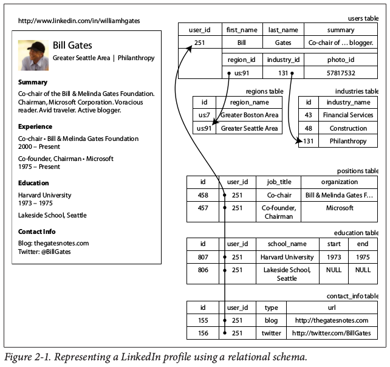
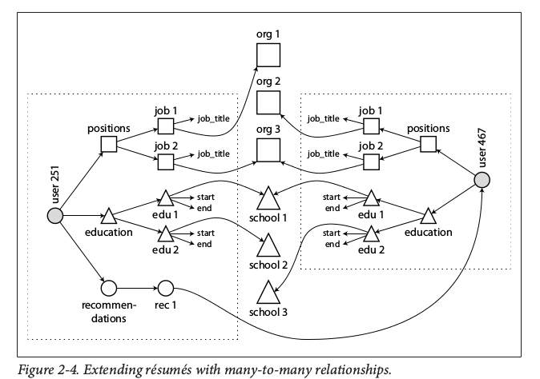

Data Intensive Design
=====================

General
-------

Many applications need to:

- Store data so that they, or other applications, can find it again later (*databases*)
- Remember the result of an expensive operation, to speed up reads (*caches*)
- Allow users to search data by keyword or filter it in various ways (*search indexes*)
- Send a message to another process, to be handled asynchronously (*stream processing*)
- Periodically crunch a large amount of accumulated data (*batch processing*)

This section describes data systems - methods to achieve reliable, scalable and maintainable data systems.

                                    O
                                   /|\
                                    /\
                                    |
                                 +--v--+
                                 | API |
                                 +-----+             asynchronous tasks
                              client|req     +-------------------------------+
                                    |        |                               |
       +-----+  read req    +-------v--------++                              |
       |inmem<--------------+ Application Code+----------------+             |
       |cache| check-if-    +-------+---------+                |             |
       +--+--+ cached               |                          |search       |
          ^                         |                          |requests     |
          |                         |                          |             |
          |                         |                          |             |
          |                    +----v------+               +---v-----+       |
          |                    |           |               |         |       |
          |                    | Primary   |               |Full-text|       |
invalidate|                    | Database  |               |Index    |       |
or update |                    |           |               |         |       |
cache     |                    +---+-------+               +---^-----+       |
          |                        |                           |             |
          |                        |capture                    |             |
          |                        |change                     |             |
          |                        |data                       |         +---v--------+
          |              +---------v------------+ apply updates|         |Msg Queue   |
          +--------------+ Application Code     +--------------+         |            |
                         +----------------------+ to search index        +---+--------+
                                                                             |
                                                                             v
              Figure 1: Possible architecture for a data system

||

**Reliability:** Continuing to work correctly, even when things go wrong. Things going wrong are called *faults*, and systems that anticipate faults and can cope with them are said to be *fault tolerant*. Generally, fault tolerance is better than fault prevention, as prevention is impossible in many scenarios.

Hard disks have a mean time to failure (MTTF) of about 10 to 50 years. Thus on a storage cluster with 10,000 disks, we can expect an average of one disk to die per day.

Human error: leading cause of outages. Hardware/network faults: 10-25% of outages.

Well designed API's, admin interfaces, abstractions will encourage people to do the right thing. Any restrictiveness in these systems will encourage them to work around them.

Good stuff: Dev environments, automated unit testing, easy to roll back config changes, gradual rollouts, clear monitoring/metrics, good mgmt practices and training.

**Scalability:** If the system scales *in a particular way*, what are our options for coping with the growth?

Describe load: num of req's/sec, ratio of reads to writes on a db, num of simultaneously active users, hit rate on a cache...

Input req/sec might be small, while fan-out of that data might be huge. 

Twitter Eg1: tweet gets posted to a global collection of tweets. When a user requests home timeline, look up all the people they follow, find all recent tweets for each of those users, and merge them (sorted by time). Relational query might look like:

    SELECT tweets.*, users.* FROM tweets JOIN users ON tweets.sender_id = users.id 
    JOIN follows ON follows.followee_id = users.id 
    WHERE follows.follower_id = current_users

Twitter Eg2 (this is what they are doing as of November 2012): Maintain a cache for each user's home timeline - like a mailbo of tweets for each recipient user. When a user posts a tweet, look up all the people who follow that user, and insert the new tweet into each of their home timeline caches. The request to read the home timeline is then cheap, because its result has been computed ahead of time.

Twitter gets ~4.6k tweets/sec, that fans out (up to 31M followers per user) to per-user caches (this fan-out costs 345k writes/sec, or an avg of 75 followers per user). Others who are getting home timeline feed/using the api read these caches, at 300k reads/sec

Response Time
^^^^^^^^^^^^^
*response time*: the time between a client sending a request and receiving a response.

Reporting on an average response time (adding up all *n* response times and then dividing by *n*) is often inadequate, as it does not tell you how many users experienced a particular delay. Random additional latency could be introduced by a context switch, loss of a packet when using TCP, a GC pause, a page fault forcing a disk read, etc. As such, response times should optimally be represented as a distribution, using *percentiles*.

The *median*, where half of a users requests are served faster than, say, 200ms, and the other half are served slower, is known as *50th percentile* (aka *p50*). In order to figure out how bad your outliers are, you can look at higher percentiles: *95th, 99th,* and *99.9th* percentiles (p95, p99, p999). These are response time threshholds where 95, 99, or 99.9% of your responses are faster than that particular threshhold.

For example, if the 95th percentile response time is 1.5 seconds, that means 95 out of 100 requests take less than 1.5 seconds, and 5 out of 100 requests take 1.5s or more.

These percentiles can be very important...for example amazon has found that those *customers with the slowest requests are often those who have made many purchases*. They also observed that a *100ms increase in response time reduces sales by 1%*, and others report that a 1 second slowdown reduces a customer satisfaction metric by 16%.

On the other hand, optimizing for 99.99th percentile was deemed too expensive.

General Scaling
^^^^^^^^^^^^^^^

*scale-up*, get a more powerful machine. *scale-out*, distribute load across multiple machines. Distributing load across multiple machines is also known as a *shared nothing* architecture. A good architecture is a mixture of these.

An *elastic* system is good for unpredictable load changes, or cost savings around ebbs and flows in traffic. Manually scaled systems are simpler, and have fewer operational surprises.

When scaling out, it's easy to distribute stateless services across many machines. It's immediately much more complex to distribute a stateful service. For this reason, it is sometimes wise to keep your stateful database on a single node (scale up) until scaling costs are too high, or high-availability requirements force you to make it distributed.

Volume of reads/ volume of writes, volume of data to store, complexity of the data, the response time requirements, the access patterns, or (usually) some mixture of all of these and many more...which operations are common vs which are rare?

Load profile:
- req/sec?
- size per req?
- desired response time?
- read vs write weighting?
- cpu vs disk vs network intensive?

Maintenance
^^^^^^^^^^^

Maintenance is the cost of software over time.

Easy for operations? metrics, alerts, logging
Simple? can new engineers understand the system. remove complexity
Extensible? can product be modified or have new features added in the future easily

**Abstractions**: always be on the lookout for good abstractions. A good abstraction hides a great deal of implementation behind a simple, clean facade, and encourages proper interaction with something.

Data Models
-----------

Relational (SQL), JSON, XML, graphs, your-inmem-structure, etc. are all different data models.

Relational vs Document model
^^^^^^^^^^^^^^^^^^^^^^^^^^^^

The nosql movement was encouraged by a need for greater scalability than relational db's can *easily* achieve, including handling very large datasets or very high write throughput. Additionally, specialized query operations that are not well supported by a relational model may be desired, and restrictiveness of relational schemas may also be frustrating. Coming up with your own data model for your own problem is useful.

**object-relational mismatch**: We treat code as objects. This often clashes with the rdbms model of tables, rows, and columns, requiring some sort of translation layer between the two. 

Think of a data structure like a resume. A normalized (ie: multi-table) representation of a resume database would include a users table along with positions, education, and contact_info tables (and more). These tables would be related via columns in the users table pointing to primary keys in other tables or foreign keys in other tables containing user_id.

Since most people have had more than one position, multiple rows in the positions table would include the same user_id foreign key. Likewise in the education table, since most people have gone to more than one school. As such, the users table has a one-to-many relationship. 

So if you want to retrieve an entire resume profile, you end up having to query each table by user_id, or perform a messy multi-way join between teh users table and its subordinate tables.

In contrast, since a resume is a mostly self-contained *document*, a json representation of a resume is quite appealing. The *one-to-many relationship* of a resume *implies a tree structure* in the data, and the JSON data structure makes this tree structure explicit.

    {
      "user_id":    251,
      "first_name": "Bill",
      "last_name":  "Gates",
      "summary":    "Co-chair of the Bill & Melinda Gates... Active blogger.",
      "region_id":  "us:91",
      "industry_id": 131,
      "photo_url":  "/p/7/000/253/05b/308dd6e.jpg",
      "positions": [
        {"job_title": "Co-chair", "organization": "Bill & Melinda Gates Foundation"},
        {"job_title": "Co-founder, Chairman", "organization": "Microsoft"}
      ],
      "education": [
        {"school_name": "Harvard University",       "start": 1973,  "end": 1975},
        {"school_name": "Lakeside School, Seattle", "start": null,  "end": null}
      "contact_info": {
        "blog":     "http://thegatesnotes.com",
        "twitter":  "http://twitter.com/BillGates"
      }
    }

.. image:: media/design-one-to-many.png
   :alt: One to many relationship
   :align: center

Why are we still using a number for region_id and industry_id? Some fields have freeform text the user can enter, while we may want other fields to have drop-downs in which the user selects an option. This makes it easy to:

- Have a consistent style and spelling across profiles
- Avoid ambiguity; eg: if there are several cities with the same name
- The name is stored in only one place, so it's easy to update across the board should a city or region name change
- When the site is translated into other languages, the standardized lists can be localized to the user's language
- Better search. Eg: a search for X industry person in region Y can be done easily. This is difficult were Y (region) to be a freeform text field.

*Nosql is bad when*:
- You have a *many-to-one* relationship (ie: many people living in one region, many people work in one industry). This is handled easily by relational DBs with joins which refer to rows in other tables by user ID or some other thing. In contrast, join support in nosql types tends to suck

If your DB does not support joins, you have to emulate a join in application code by making multiple queries to the database. Additionally, even if your initial version of an application fits well in the join-free document model, data has a tendency of becoming more interconnected as features are added to applications. For example, consider some changes to the resume example:

Organizations and schools as entities: in the figures above, organization and school_name are both just strings. It would be useful if they were references to entities themselves...perhaps back to the school's page, or the organization's page, which each resume can link back to.

Recommendations: One user can recommend the skill of another. The recommendation shows up on the target resume page with the recommender's photo and name. What happens if he/she updates their profile picture or changes their name? It needs to be updated everywhere. This isn't really scalable in a document model - the user recommendation should refer back to the recommender's profile.

Relational DB's can use many-to-many without thinking twice. So where does this leave nosql? Well, it hasn't solved this problem, so it leaves it in the realm of one-to-many relationships.

You cannot easily refer to a nested item within a document, but this is generally not too much of a problem so long as the nesting isn't too deep. You also can't easily do joins, but this can be mitigated by denormalizing your data. Denormalization can sometimes suck though, as any changes to "common" data now have to be applied to hundreds, thousands, millions of documents in order to make the data consistent. Joins can also be emulated by making multiple document calls, but this adds complexity to the application, and is usually slower than something designed to do joins (ie: a relational DB).

Schemas
^^^^^^^

A document database usually has an *implicit schema*, where there is some kind of structure to the documents but the document database doesn't enforce any type of schema. This is what's called *schema-on-read* - the structure of the data is implicit, and only interpreted when the data is read.

In contrast, *schema-on-write* is the traditional approach of relational databases. The schema is *explicit* and enforced by the DB, and the DB ensures all writes to it conform to a defined schema.

The difference between approaches becomes noticable when you, say, have a field in your schema "Name" and you want to split it out into "First_Name" and "Last_Name". In a document DB, you'd simply start writing new documents with the new fields, and have code in the application that handles the case when old documents are read.

On the other hand, in a "statically typed" database schema, you would typically perform a migration along the lines of:

    ALTER TABLE users ADD COLUMN first_name text;
    UPDATE users SET first_name = substring_index(name, ' ', 1);

Schema changes have a bad rep of being slow and requiring downtime. While this is often true for MySQL, other relational db's can do the ALTER in milliseconds.

Documents offer additional benefit in that they are typically read in their entirety, in one contiguous string or binary blob. This allows efficient read-ahead. However, a significant downside to this is that each time a document needs to be updated, the entire thing needs to be read and then re-put into the document store. This severely limits the practical size-per-document. Only modifications that don't change the encoded size of a document can easily be performed in-place, otherwise the document has to be re-written.

Note that the data locality of a document store can also be leveraged in certain databases. Google's Spanner database allows the schema to declare that a table's rows should be interleaved (nested) within a parent table. If a row is a tuple, then this feature would mean a tuple could be one (or all) of the elements inside a tuple. Oracle allows this feature as well - they call it "multi-table index cluster tables". This nested table (*column-family*) concept is also found in databases that follow the Bigtable data model (cassandra and hbase)

Note that postgres and others (not mysql) already support JSON documents to some extent (expand), and some document databases support relational-like joins (such as RethinkDB).

So to summarize, *a nosql solution might be ideal if your data*:
- Are mostly small, self-contained *objects/documents*
- Elements have a *one to many* or *tree-like* structure (heading: "multiple, things")
- The entire tree is typically loaded at once (good *data locality*), in a continuous string/binary (good read-ahead)
- Your data is heterogeneous - ie: many minor differences

Otherwise use a relational DB, especially if your data is relational in a many-to-one, or many-to-many relationship where you need to run joins. Also choose relational if your data is homogenous and/or you desire normalized data.

Query Languages for Data
------------------------

Imperative vs Declarative
^^^^^^^^^^^^^^^^^^^^^^^^^

Most commonly-used programming languages are *imperative*. For example, if you have a list of animals and you only wanted to return sharks, in an imperitive language you might do this:

    def getSharks():
      sharks = []
      for animalObj in animals:
        if animalObj.family == "Shark":
          sharks.append(animal)
      return sharks

On the other hand, in a *declarative* language, you might do this:

    SELECT * FROM animals WHERE family = 'Sharks';

As to the first example, an imperative language tells the computer to perform certain operations in a certain order. You can imagine stepping through the code, line by line, evaluating conditions as you go. In a declarative query language, like SQL or relational algebra, you just specify the pattern of the data you want - what conditions the results must meet, and how you want it to be transformed (eg: sorted, grouped, and aggregated), but not *how* to achieve that goal. It is up to the database's query optimizer to decide which indexes and which join methods to use, and in which order to execute various parts of the query.

Also consider CSS, making certain elements blue when selected vs in javascript where making things blue when selected would require a loop over page contents looking for all elements that match selected and then changing them blue.

MapReduce Querying
^^^^^^^^^^^^^^^^^^

Graph-like Data Models
^^^^^^^^^^^^^^^^^^^^^^

The relational model can handle simple cases of many-to-many relationships, but as connections within your data become more complex, it becomes more natural to start modeling your data as a graph.

A graph consists of two kinds of object: *vertices* (also known as *nodes* or *entities*), and *edges* (also known as *relationships*).

Many types of data can be modeled as a graph. Examples include:

Social graphs: vertices are people, edges indicate which people know each other
Web graphs: vertices are web pages, edges indicate HTML links to other pages
Road or rail networks: Vertices are junctions, and edges represent the roads or railway lines between them

