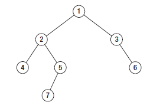

.. _interview:

Interview Material
==================

TODO: 
- Fix all ref links.
- Finish all questions and coding challenges

Facebook
--------
presreen q's system, networking, posix signals (done)
1st: 45min coding (phone), practical, relavent to sysadmin, some comp sci fundamentals.
2nd: 45min systems (phone)

(onsite) deeper coding, deeper systems, networking, architecture, collab/team building scenario questions

Study more of:
- kill -9 will not remove a zombie process...why?
- Signals
- core dumps
- process states (scheduled? wait? runnig? sleep? uninterruptible?)
- make a section about kexec
- python:
  - input/output practice
  - interfacing with external proceses
- design: kleppmann's book

Questions
---------
- What is an initrd and why is it needed?
initrd stands for Initial RAM Disk. PXE/some_bootloader extracts and executes the kernel, and then the kernel can extract and mount its associated initrd. initrd provides a virtual root filesystem which contains several executables and modules that permit the real root filesystem to be mounted, or to do whatever else you'd like at that point in the boot process.

Nearly all of initrd's use cases involve needing to load some needed module into the kernel in order to support a non-standard root filesystem, LVM, network drive, or RAID controller prior to full boot. You may also choose to rebuild your kernel to include necessary modules and get rid of the initrd; however, in the instances of needing to mount a network drive, run some sort of process that doesn't need to boot fully into linux, or do some other "staging" type thing, an initrd environment is useful.

- Files, inodes, filesystems...how do they work? What are file descriptors? 
**Filesystems, inodes, file descriptors**: Described in :ref:`filesystems`

- What are semaphores? What is a mutex? What's the difference between the two?
A semaphore is best described as a signaling mechanism, but could also be described as a type of lock. A semaphore is an object that contains a (natural) number, on which two modifying operations are defined. One operation, V, adds 1 to the number. The other operation, P, removes 1. Because the natural number 0 cannot be decreased, calling P on a semaphore containing 0 will block the execution of the calling process/thread until some other thread comes along and calls a V on that semaphore. You may create a semaphore with more than one "slot" available (ie: s(6)). As such, semaphores can be used to restrict acess to a certain resource to a maximum (but variable) number of processes.

A mutex is a locking mechanism which helps multiple tasks serialize their access to a shared resource. It's simply some function or object you call prior to performing a block of code on some shared resource. Your first call sets a locked flag, then you run your code, and then your second call to the mutex releases the lock.

You might think of a semaphore or a mutex as a key to a bathroom. One key, one door works well for a mutex or a semaphore(1). But above we mentioned semaphores can count higher than one...so one key for six bathrooms. A mutex will not scale in this scenario as it would block each time 1/6 resources are used. A semaphore will allow 6 people to use the bathrooms at once, but it has no idea which bathroom is free at which time. What you end up needing is a separate mutex for each resource regardless. 

Because of this, you should not be relying solely on semaphores for locking - in fact, you really should only be using semaphores for simple signaling. For example, have a semaphore for power button which your display subscribes to (semaPend(sem_pwr_button); //wait for signal), such that when the power button is hit, a post (V, increment, semaPost(sem_pwr_button); //send the signal)) is sent and your display thread then unblocks and performs some_code. Another use could be naive throttling: only allow 3 threads to access a database at once.

- How are cookies passed in the HTTP protocol?
The server sends one of these in its response header (square brackets optional):
    Set-Cookie: <em>value</em>[; expires=<em>date</em>][; domain=<em>domain</em>][; path=<em>path</em>][; secure]

Note that "value" above is a string, and is almost always in a format like this: **key=value** , and is usually enforced as such.

And if the client accepts the cookie write, it sends this in its next request header:
    Cookie: name=value

- How does traceroute work? 
ICMP packets are sent, with the initial packet having a TTL of 0 and each consecutive packet having its TTL incremented by one. This elicits a response along each hop of a network path. The TTL count exists in the IP header.

Google Glassdoor
^^^^^^^^^^^^^^^^
- Rank the following in terms of speed: access a register, access main memory, perform a context switch, hd seek time
1 Register. 1 or 2 cycles. Smallest and fastest memory on a system. A compiler will typically allocate registers to hold values retrieved from main memory.
2 Perform a context switch (which type? assuming thread switch). 30-60 cycles best case.
3 Access main memory. NUMA local: 100 cycles NUMA remote: 300 cycles for no/normal congestion
4 HD seek time. A typical hdd needs anywhere from 2.5ms to 6.5ms to seek, depending on rotational speed (2ms=15k). Arm movement (stroke/track-to-track) takes anywhere from 0.2 to 1ms. SSD seek time is around 0.08-0.16ms

**Context Switch:** The process of storing execution state of a process or thread so that execution can be resumed from the same point at a later time.

    "Context Switch" can mean several different things, including: thread switch (switching 
    between two threads within a given process), process switch (switching between two 
    processes), mode switch (domain crossing: switching between user mode and kernel mode 
    within a given thread), and more. 

Which type of context switch you're talking about can mean a very different performance costs. For example, a context switch pausing one thread and the cpu scheduling another where each thread is not sharing memory (separate working sets) could dirty the cpu cache if there is not enough space to hold both thread's memory or the new thread fills the cache with new data. The same is true for processes. Additionally, if two processes share the same working set of memory and one is context switched out and another is scheduled in on a different core, it does not have access to the same cache/working set without a NUMA hop or a trip to main memory.

http://blog.tsunanet.net/2010/11/how-long-does-it-take-to-make-context.html

- What information is contained in a file inode?
**Filesystems, inodes, file descriptors**: Described in :ref:`filesystems`

- How is MTU size determined?
MTU is referenced by packet (and frame) based protocols like TCP and UDP in order to determine the maximum size of packet it should construct for communication over a given interface. Something called **Path MTU Discovery** (PMTUD) is used in order to discover this value.

In IPv4, this works by setting the *DF* (don't fragment) bit in the ip header of outgoing packets. Any device along the network path whose MTU is smaller than the packet will drop it and send back an ICMP *fragmentation needed* message containing its MTU. The source host reconfigures appropriately, and the process is repeated.

IPv6 works differently as it does not support fragmentation (nor the don't fragment option). Instead, the initial packet MTU is set to the same as the source interface, and if it hits a device along the path where the packet size is too large for its MTU setting, that device drops the packet and sends back an ICMPv6 *Packet Too Big* message which contains its MTU. The source then reconfigures its MTU appropriately, and the process is repeated.

If the path MTU changes lower along the path after the connection is set up, the process still does its thing. If the MTU changes to a higher value, PMTUD will eventually discover this (Linux performs another PMTD check every 10 minutes by default) and increase MTU accordingly.

Some firewall operators will blanket deny all ICMP traffic. This means that after a TCP handshake happens and the first packet is sent out with a larger MTU than something along the link can handle, the firewall blocks the ICMP reply and you end up with a "black hole" connection where the source keeps retrying to send data and some device along the path keeps dropping it, with a blocked response. Some PMTUD attempt to infer this problem and lower MTU size accordingly, but the lack of response could also just be due to congestion.

Some routers may work around this issue by changing the *maximum segment size* (MSS) of all TCP connections passing through links which have an MTU lower than the ethernet default of 1500. While an MTU is concerned with the total size of a packet, MSS only determines the TCP Segment (minus TCP header) size - typical default = 536 Bytes.

[TCP Packet[TCP Segment[IP datagram[Data link layer Frame]]]]
[UDP Datagram[UDP Segment[IP datagram[Data link layer Frame]]]]

Also reference: :ref:`networking-mtu`

- Which system call returns inode information? (study all common system calls and know them)
**Kernel - System Calls**: :ref:`kernel-systemcalls`

- What are signals? What signal does the "kill" command send by default? What happens if the signal is not caught by the target process?

Check out :ref:`kernel-signals`

Signals are software interrupts. Kill sends a SIGTERM by default. The kernel delivers signals to target processes or process groups on behalf of an originating process, or on behalf of itself. If the originating process has the permissions to send a signal to another, the kernel forwards it on.

Note that processes can ignore, block, or catch all signals except SIGSTOP and SIGKILL. If a process catches a signal, it means that *it includes code that will take appropriate action when the signal is received*. If the signal is not caught, the kernel will take the appropriate action for the signal.

* SIGHUP hangup. Send this to a terminal and it will likely log you out. Other applications may instead use this signal as an indication to reload their configuration without terminating themselves.
* SIGINT is sent when you ctrl-c something. It is intended to provide a mechanism for an orderly, graceful shutdown of the foreground process. Interactive shells (mysql, other) may take it to mean "terminate current query" rather than the whole process.
* SIGQUIT signals a process to terminate and do a core dump
* SIGSTOP suspends a processes execution. If you are experiencing some sort of intermittent socket/buffer full or backflow buildup related bug, SIGSTOP is a good way to reproduce the issue. File handles will be kept open.
* SIGKILL is the ol' kill -9

- Describe a TCP connection setup
Look here: :ref:`networking-tcp`

- What happens when you type 'ps' (shell word splitting, searching PATH, loading dynamic libs, argument parsing, syscalls, /proc, etc. expand)
A variant of "the rabbit hole" question. :ref:`rabbithole`

- what is the worst case time for a quicksort?
O(n^2) for already-sorted lists if your pivot is the final element in the array you're sorting, or if all elements in an array are the same. Quicksort performance generally depends on your pivot. Look here: :ref:`algorithms`

- What is the maximum length(depth) of a binary tree?
http://codercareer.blogspot.com/2013/01/no-35-depth-of-binary-trees.html

Max depth is *n*, ie: unlimited. The maximum depth of a binary tree is the length of the longest path.

 
In this image, we can see that the left subtree has a depth of 3 while the right subtree has a depth of 1. So long as the difference in depth between two branches is no greater than 1, it is considered *balanced*. Therefore, the binary tree depicted in this image is balanced.

- What is the theoretical best trans-continental round-trip ping time?
Light travels at just below 300,000KM/sec. Light travels through fiber around 30% slower, so 210,000KM/sec. London to NYC is about 5500KM. So, 5500/210000 = 0.026, or 26ms. Routers/switches only add microseconds of delay, so being generous, add 1ms total for both sides. So RTT = around 53ms. Verizon consistently sees 72ms between london and nyc in the real world.

- How do you solve a deadlock?
A deadlock occurs when multiple processes/threads must acquire *more than one shared resource*, or in the case of *recursive/self deadlock* where a thread tries to acquire a lock that it is already holding. Recursive deadlocks are the most common as they are easy to program by mistake. For example, if some function calls code to some other outside module which over some path ends up calling a function in the original module which is protected by the same mutex lock, then it will deadlock. The solution for this type of deadlock is to know your code path. Avoid calling functions outside the module when you don't know whether they will call back into the module without reestablishing invariants and dropping all module locks before making the call.

In the case where multiple shared resources are needing to be locked prior to performing an operation, if two or more concurrent process obtain multiple shared resources indescriminately a situation can occur where each process has a resource needed by another process. As a result, none of the processes can obtain all the resources it needs and as such all are blocked from further execution. Within a single application, deadlocks most often occur when two concurrently running threads need to lock the same two or more mutexes. The common advice for avoiding this type of deadlock is to always lock the two mutexes/resources in the same order: if you always lock mutex A before mutex B, then you'll never deadlock.

- Difference between processes and threads
*Processes are the abstraction of running programs*: A binary image, virtualized memory, various kernel resources, an associated security context, etc. A process *contains* one or more threads.

*Threads are the unit of execution in a process*: A virtualized processor, a stack, and program state. Threads share one memory address space, and each thread is an independent schedulable entity.

Put another way, processes are running binaries and threads are the smallest unit of execution schedulable by an operating system's process scheduler.

- What is a socket?
A socket is a way to speak to other programs using standard Unix file descriptors. When Unix programs do any sort of I/O, they do it by reading or writing to a file descriptor. A file descriptor is simply an integer associated with an open file. This file can be a network connection, a FIFO, a pipe, a terminal, a real on-disk file, or just about anything else! Read more about sockets here: :ref:`linux-kernel-sockets`

- What is a transaction (db)?
A transaction is simply a completed operation. Read more about RDBMS+ACID or NoSQL+CAP/Other here: :ref:`rdbms`

- What algorithm does python's .sort() use?
Timsort! Read more here: :ref:`algorithms-sorting` 

Facebook Glassdoor
^^^^^^^^^^^^^^^^^^
- What is a filesystem, how does it work?
A filesystem is a method of organizing data on some form of media. Read about specific filesystems here: :ref:`filesystems`
 
- What is a socket file? What is a named pipe?  
Read more about sockets here: :ref:`linux-kernel-sockets`. A named pipe is just a | that exists on a filesystem rather than only in your command line. Here are some cool things you can do with named pipes:

Create a pipe that gzips things piped to it and then outputs to a file:

  mkfifo my_pipe
  gzip -9 -c < my_pipe > out.gz &
  # Now you can send some stuff to it
  cat file > my_pipe

An example that is perhaps more useful is this:

  mkfifo /tmp/my_pipe
  gzip --stdout -d file.gz > /tmp/my_pipe # Decompress file.gz, send to my_pipe
  # Now load the uncompressed data into a MySQL table:
  LOAD DATA INFILE '/tmp/my_pipe' INTO TABLE tableName;

So what we did here was use a named pipe in order to transfer data from one program (gzip decompressing stuff) to another (mySQL). This allowed us to write out the entire uncompressed version of file.gz before loading it into MySQL, rather than having to decompress the whole thing first.

(RobertL: Data written to a pipe is buffered by the kernel until it is read from the pipe. That buffer has a fixed size. Portable applications should not assume any particular size and instead be designed so as to read from the pipe as soon as data becomes available. The size on many Unix systems is a page, or as little as 4K. On recent versions of Linux, the size is 64K. What happens when the limit is reached depends on the O_NONBLOCK flag. By default (no flag), a write to a full pipe will block until sufficient space becomes available to satisfy the write. In non-blocking mode (flag provided), a write to a full pipe will fail and return EAGAIN.)
 
- What is a zombie process? How and when can they happen?
When a process ends via exit, all of the memory and resources associated with it are deallocated; however, the process's entry in the process table remains. Its process status becomes EXIT_ZOMBIE and the process's parent is sent a SIGCHLD signal by the kernel letting it know that its child process has exited. At this point, the parent process is supposed to call a wait() in order to read the dead process's exit status and such. After the wait() is called, the process's entry in the process table is removed.

If a parent process doesn't handle the SIGCHLD and call wait(), you end up with a zombie process. Let run wild under high load, you may run out of PIDs. To get rid of zombie processes, you may try using kill to send SIGCHLD to the parent, and if that doesn't work, kill the parent. The zombie will become an orphan which is then picked up by init (1), who calls wait() periodically.

- What does user vs system cpu load mean?
Read more about the user and system separation in :ref:`linux-internals`.

- How can disk performance be improved?
Caching, sequential reads/writes, block/stripe alignment.

- Explain in every single step about what will happen after you type "ls (asterisk-symbol-redacted)" or "ps" in your terminal, down to machine language
Variant of :ref:`rabbithole`

- Suppose there is a server with high CPU load but there is no process with high CPU time. What could be the reason for that? How do you debug this problem?
Might be due to something causing high IOWait and not having associated higher cpu usage. If everything else is basically idle, this is usually an indicator that the disk/controller you're writing to is about to die. If there's a process at something really low, like 7% or something, then it could just be pushing a lot of data to slow media and not requiring much cpu time to do it. iostat will tell you what disk is being written to, and iotop will tell youwhich process it is. If you don't have these tools installed, look for processes that are in uninterruptible sleep:

  while true ; do ps -eo state,pid,cmd|grep "^D" ; sleep 1 ; done

Anything marked with a "D" at the start are in uninterruptible sleep, or a wait state. If you see a suspicious process, cat /proc/<pid>/io a couple times to see its io activity. You can also check lsof to see what file handles it has open.

  cat /proc/12345/io
  lsof -p 12345

If you're not seeing high IOWait, the high cpu is likely due to many very short lived processes stuck in a crash loop or doing some other thing it's not supposed to. atop shows you all processes which have lived and died over a polling period. Alternately, Brendan Gregg has a tool called execsnoop which he built for exactly this problem. If your kernel is new enough, you can use systemtap as well.

- What happens when a float is cast to/from a boolean in python?
If float == 0: bool = False ; else: bool = True  ? Not sure what more to say here
  
- Given a database with slow I/O, how can we improve it?
  - If relational, check out :ref:`rdbms` notes.
  - Profile the thing to see where it's slow (expand)
  - indexing (expand)
  - disk optimisations (expand)

- What options do you have, nefarious or otherwise, to stop people on a wireless network you are also on (but have no admin rights to) from hogging bandwidth by streaming videos?
  - discover their mac address (iwconfig wlan0 mode monitor;tcpdump), create another interface and assign their mac address as your own, make script to forever perform gratuitous ARP until offender gets annoyed at poor performance and stops using internet. (might also just be able to do arping -U ip.addre.s.s & echo 1 > /proc/sys/net/ipv4/ip_nonlocal_bind http://serverfault.com/questions/175803/how-to-broadcast-arp-update-to-all-neighbors-in-linux) 
  - If you can gain access to wifi router, ban their mac or set QoS if available
  - (expand)

- How exactly does the OS transfer information across a pipe?
:ref:`linux-internals-systemcalls`
Linux has an in-memory VFS called pipefs that gets mounted in kernel space at boot. The entry point to pipefs is the pipe(2) syscall. This system call creates a pipe in pipefs and then returns two file descriptors (one for the read end, opened using O_RDONLY, and one for the write end, opened using O_WRONLY).

In the case of unnamed pipes using bash, bash will call pipe(2) and get its file descriptors back, dup2 the pipe's stdin and first program's stdout, start up the second program and dup2 its stdin with the pipe's stdout.

The "left" program writes out, and that data ends up in a 64KB (usually) sized buffer, which is immediately read by the "right" program. Once the "left" program is done writing, it closes its fd, and the listening end then gets an EOF (read(2) will return 0). 

If the pipe is full, the write will block. If the pipe is empty, the read will block. It's possible to create FIFOs or socket files non-blocking, which will return an error if full.

- What problems are you going to run into when doing IPC (pipes, shared memory structures)?
In computer science, "Classic" IPC problems all refer to resource contention, or synchronization and deadlock problems. These are generally solved by using semaphores and mutexes, and ensuring access to multiple mutexes is done in order.
  https://en.wikipedia.org/wiki/Producer%E2%80%93consumer_problem
  https://en.wikipedia.org/wiki/Readers%E2%80%93writers_problem
  https://en.wikipedia.org/wiki/Dining_philosophers_problem
  https://en.wikipedia.org/wiki/Sleeping_barber_problem

- What is "file descriptor 2"
STDERR. fd0 is STDIN, and fd1 is STDOUT. Read more in :ref:`linux-file-descriptors`

- What's the difference between modprobe and insmod?
Modprobe is more intelligent than insmod. It refers to a /lib/modules/$(uname -r)/modules.dep.bin (or other depending on OS) dependency file to read available modules and their dependencies. It'll accept the name of .ko files in /lib/modules/$(uname -r) as well. Insmod on the other hand will not do dependency resolution, and accepts paths to module files. Modprobe uses insmod to do its work once it does its more intelligent work.

Study Topics
------------
- Brush up on RAID
The RAID write hole problem can crop up when a power loss or some other event causes a disk write to be interrupted such that raid parity bits are not consistent with the data. Prevent this by using Battery Backed caches or PDUs, and/or consider storage systems that use transactional-style writes.

- learn the particulars of ssh
- core system functionality such as I/O buffering

- (googs)Prepare for Hashmap/hashtable questions

- (googs)Understand how job scheduling is handled in the most recent iterations of the kernel
:ref:`linux-internals-scheduling`

- (googs)Know your signals
See above, "What are signals?"

- (googs)Study up on algorithms and data structs
:ref:`algorithms`

- (googs)Study the book "Cracking the Coding Interview" for several weeks prior to interviewing. practice "whiteboarding" your code

- (fb)Review DNS, TCP, HTTP, system calls, signals, semaphores, complete paths (ie: telnet blah.com 80), boot process (incl UEFI)

- (fb)Refresh CCNA related knowledge, TCPDump commands (memorize syntax, memorize basic "listen"), ipv6 notes, load balancing types, load balancer failover modes & how VIP mac addr changes (gratuitous/unsolicited ARP), direct routing vs NAT, jumbo frames, MTU size, fragmentation and when it can occur, what a packet looks like

- (fb)Review systemtap, perftools, sar(sysstat), and other options

- (fb)Write about shared file systems which are read/written to from many servers.

- (fb)Write about distributed systems and different types of consistency models and where they are used

Design
------
Reference stackshare.io for ideas.

* (googs)How would you design Gmail?
* (googs)How do you best deal with processing huge amounts of data? (if you say map reduce, learn a ton about it)
* (fb)Outline a generic performant, scalable system. From frontend (lb's? or cluster-aware metadata like kafka) to backend (db's, storage, nosql options, etc). Remember networking as well: what features does a high performance network card supply - what can it offload? What should you tweak network wise for high bandwidth connections
* (fb)How would you design a cache API?

* (fb)How would you design facebook?
1) Define desired features, and split them into their own design. ie: photos, video, news feed, messenger, events

Video: Use GPU's to transcode streams to different quality levels

* (fb)How would you design a system that manipulates content sent from a client (eg: clean bad words in a comment post)?
For the clean bad words from a comment post, I would consider splitting the words in a comment post to a list (order matters here if we are to reconstruct the sentence, so can't sort or use a dict) and then iterating over them against a badwords hash/dict where the dict key is the badword. This would be O(n)+O(1), or an O(n) operation (this assumes that the hash function for the dict keys is sufficiently robust to make collisions uncommon, giving linear time O(1)).

If badwords is massive, you could consider keeping it sorted and then doing a binary search (O(log n)) against it when comparing words.

If the comment is huge or has many duplicate words and we want to prevent comparing them against the badwords more than once, you could consider splitting each word to a dict where the key is the word, and then doing a str.replace() on the original comment text if a badword match is found.

* Design the SQL database tables for a car rental database.
* How would you design a real-time sports data collection app?
* design a highly-available production service from bare metal all the way to algorithms and data structures. (eg: gmail, hangouts, google maps, etc.)

Coding Questions
----------------

Google Glassdoor
^^^^^^^^^^^^^^^^
- Implement a hash table
dicky = {'herp': 1, 'derp': 2, 'potato': 3}

- Remove all characters from string1 that are contained in string2
This is O(n), but inefficient as strings are immutable in python, so string1 keeps getting recreated.
  string1 = "can you still read this?"
  string2 = "aeiou"
  for char in string2:
    string1 = string1.replace(char, "")
  return string1

str.translate() in python uses C string magic, ends up being fastest at *removing* chars

Python 2 only:
  string1 = "can you still read this?"
  string2 = "aeiou"
  string1.translate(None, string2)

Python 3's translate method expects a translation table (ie: dict) passed to it which contains the unicode ordinal value of a character as the key, and an associated ord, str, or None as the value. maketrans() will create this table for us. Any characters entered in the *third* argument will be mapped to None, which is what we want in this case
  string1 = "can you still read this?"
  string2 = "aeiou"
  charTransTable = str.maketrans('', '', 'aeiou')
  # or
  charTransTable = str.maketrans('', '', string2)
  string1.translate(charTransTable)

- implement quicksort. Determine its running time.

- Given a numerym (first letter + length of omitted characters + last letter), how would you return all possible original words? E.G. i18n the numeronym of internationalization
- Find the shortest path between two words (like "cat" and "dog), changing only one letter at a time.
- Reverse a linked list
- Write a function that returns the most frequently occurring number in a list
- Do a regex to get phone numbers out of a contacts.txt file

Facebook Glassdoor
^^^^^^^^^^^^^^^^^^
- re-implement 'tail' in a scripting language
  - From lern/tail.py:

  import time
  import sys
  def main(f):
    # Go to end of file
    f.seek(0, 2)
    # Start printing from EOF minus 100 chars. If file not 100chars, start printing from beginning
    pos = f.tell() - 100
    if pos < 0:
      f.seek(0)
    else:
      f.seek(pos)
      # Using readline() and silencing output will cheaply get our file position pointer to the next
      # line without printing a truncated line to the user (as a result of seeking back an arbitrary
      # 100chars)
      silence = f.readline()
    while True:
      # The method tell() returns the current position of the file read/write pointer within the file.
      position = f.tell()
      # readline() reads a line and then advances the position read/write pointer on the file object
      line = f.readline()
      # If readline doesn't return anything, sleep for a second
      if not line:
        time.sleep(1)
      else:
        print line,
  if __name__ == '__main__':
    main(open(sys.argv[1]))

- Battleship game: write a function that finds a ship and return its coordinates.

- Write a script to ssh to 100 hosts, find a process, and email the result to someone
  for s in $(cat hosts) ; do ssh user@${s} "ps -ef|grep blah|grep -v grep|mail -s "This is the subject" user@myemail.com" ; done
  - For anything more complicated, or sent out to thousands of nodes instead of hundreds, I would consider trying out Rundeck instead of an ssh loop. Could also use salt, ansible, or mcollective if these are already in use in the org

- Write a function to sort a list of integers like this [5,2,0,3,0,1,6,0] in the most efficient way
  sorted(listy)
  - :ref:`algorithms-sorting`

- Given a sentence, convert the sentence to the modified pig-latin language: Words beginning with a vowel, remove the vowel letter and append the letter to the end. All words append the letters 'ni' to the end.

  sentence = "The origin of species is a detailed book requiring many hours of study"
  listsentence = sentence.split()
  pigsentence = []
  vowels = "aeiou"
  for w in listsentence:
    for v in vowels:
      if w[0] == v:
        w = w[1:]
        w += v
        break
    w += "ni"
    pigsentence.append(w)
  " ".join(pigsentence)

- take input text and identify the unique words in the text and how many times each word occurred. Edge cases as well as performance is important. How do you identify run time and memory usage?
  - Here's a rough script. Needs syntax removal and lower-casing everything:
  import sys
  def freqgen(wlist):
      dicky = {}
      for w in wlist:
          try:
              dicky[w] = dicky[w] + 1
          except KeyError:
              dicky[w] = 1
      # Let's convert the dict to a list of tuples (dicky.items()) 
      # for easier sorting. Key off the second value in each tuple
      for k, v in sorted(dicky.items(), key=lambda x: x[1]):
          print(k + " " + str(v))
  if __name__ == '__main__': 
      with open(sys.argv[1], "r") as f:
          bigstring = f.read().replace("\n", " ")
          wlist = bigstring.split()
      freqgen(wlist)
  - Runtime:
  python3 -m cProfile wordfreq.py short-story.txt
  - Check out runsnakerun for visualization of cProfile output, pretty cool. www.vrplumber.com/programming/runsnakerun/
  python3 -m cProfile -o out.profile wordfreq.py short-story.txt ; python runsnake.py out.profile
  - Memory. There is a module called memory_profiler that will output, line by line, how much memory your script uses:
  pip install -U memory_profiler
  pip instlal psutil #this is for better memory_profiler module performance
  vim freqgen #add @profile decorator above the function you're interested in
  python -m memory_profiler freqgen.py short-story.txt

- build a performance monitoring script, adding more features and improving efficiency as you go

- For a given set of software checkins, write a program that will determine which part along the branch where the fault lies. 
 - So we assume we already have a list of git revisions, and once a certain revision gets hit everything after it fails
 - Do a binary search in order to determine where the build starts breaking. Ie: pick the middle number, do a checkout, build, if fail then do another binary search in the middle of startrevision and failedrevision-1. If success, then do another binary search between successrevision+1 and finalrevision..etc etc. Do this until you find that failedrevision-1=a successful revision

- Given a list of integers which are sorted, but rotated   ([4, 5, 6, 1, 2, 3]), search for a given integer in the list. 
 - Think of the array as two separate lists. If number we're searching for is less than or equal to the last number in the array (3 in this case), then cut array in half and do a binary search on just that half until number is found

    For above questions, elaborate on theoretical best performance. Talk about 
    memory vs CPU usage. Talk about whether certain system calls take more 
    resources than others. How long it takes to: access a register, access main 
    memory, perform a context switch, hd seek time

General
^^^^^^^
- re-implement nc in python
- re-implement grep in python
- make a url shortener in python

Quickies
--------
Make immutable, can't delete this file:
    chattr +i filename

Special file being a douche to rm? eg: $!filename, -filename, 'filename-
    ls -i    #list by inode
    find . -inum 1234 -exec rm {} \;
